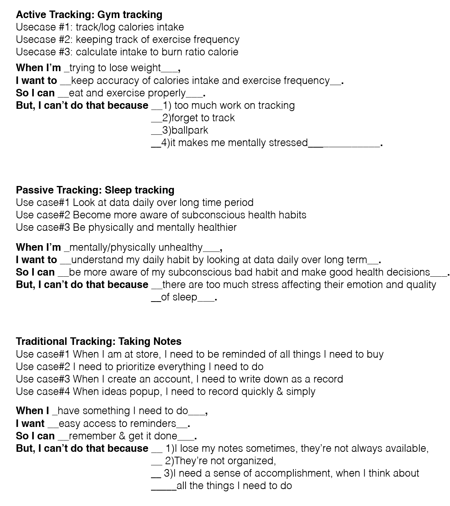
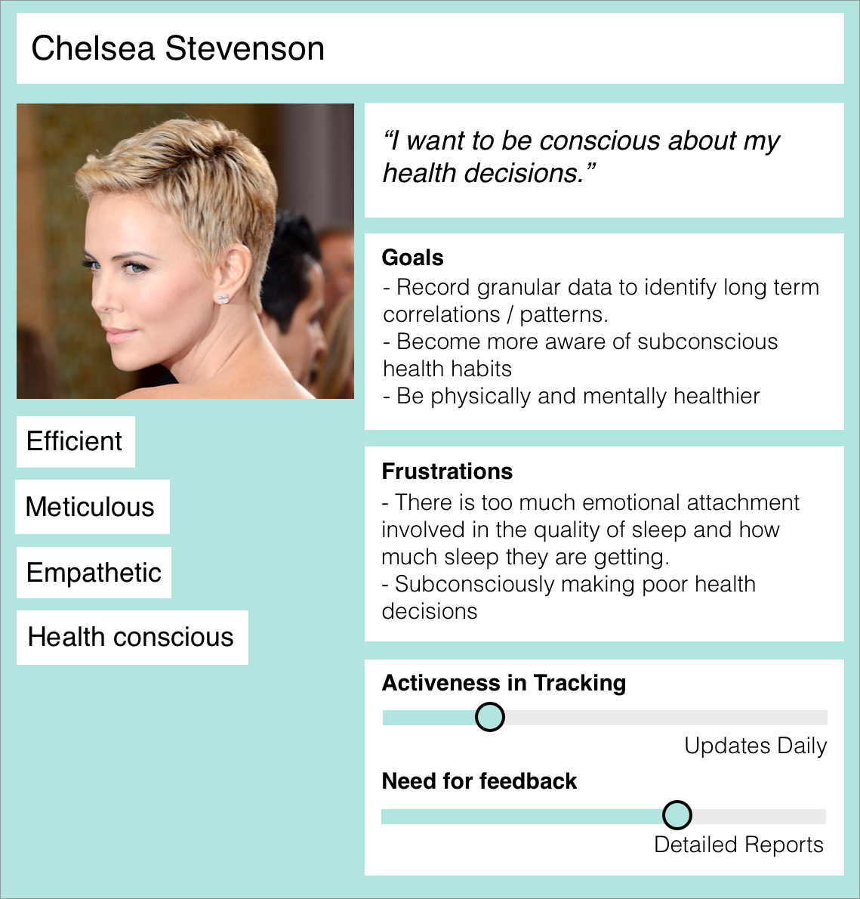
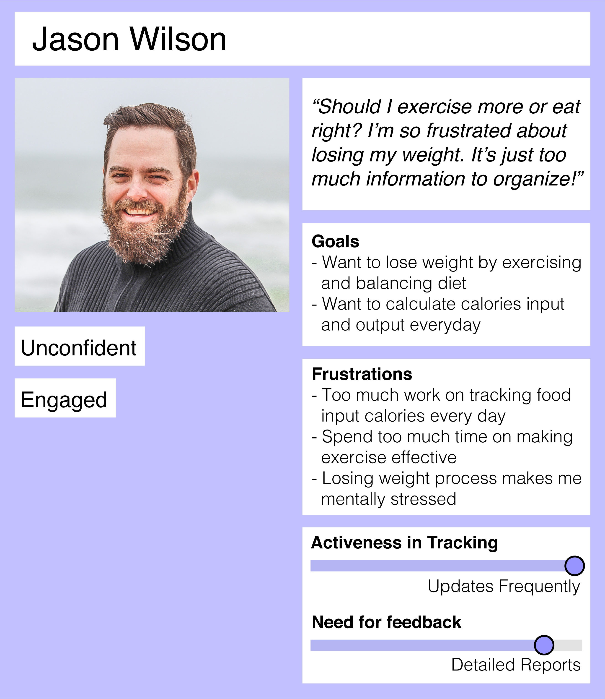
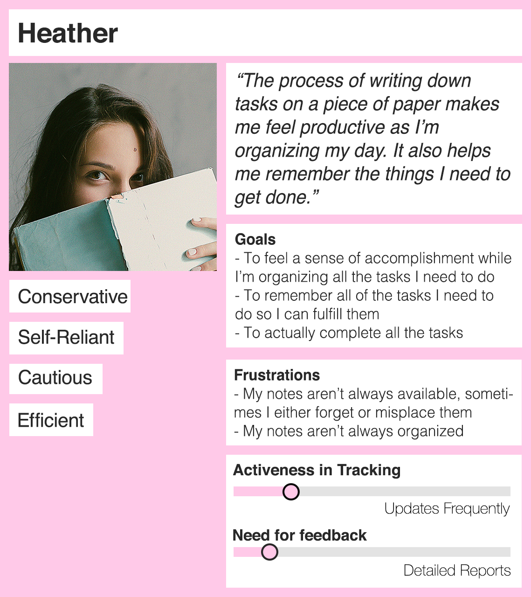

# Milestone2: Gathering Information & Planning

## Target Audience

Before collecting any data for our research phase. We had 3 diffent target audience to find out about needs for different groups of people.

1. Passive Sleep Tracking Application Users
    -Users who use sleep tracking application to track their sleeping patterns, but not actively feed in their data.
2. Active Fitness Tracking Application Users
    -Users who use workout application to track their fitness and workout routines, and also input their data actively.
3. Non-tracking Traditional Users
    -Users who use notebooks to write grocery lists for shopping

## Gathering Information (Contextual Interviews + Affinity Diagramming + Affinity Grouping)

**We decided to interview 4 individuals per target audience.**

We collected data from 12 individuals through interviews. 

Interview Questions and Analysis is [here](milestone2-documents/interview.pdf). All interview notes are stored in meeting pics folder as well.

After collecting the data, we conducted an Affinity Grouping exercise to further consolidate answers to questions per target audience and get a feeling for the sense of direction they were heading. Following which we summarized each group into a cohesive voice, and proceeded onto conducting an Affinity Diagram to further consolidate the three target audiences into one general broad audience. Afterwards, we framed these voices into task-based scenario's (People Problems In Facebook's Terminology). Based on these task-based stories, we were able to create a minimal viable product list for our feature, and prioritized them based on importance. Pictures of diagrams are stored in meeting pictures folder.

## Value Propositions

Our application offers a one stop shop for all your tracking needs. By modularizing core functionalities, users are able to customize data and gain insights. This in turn enables users to record in granularity and organize routines in life while feeling a sense of accomplishment. 
Use this app to keep track of your: progress at the gym, to-do lists, sleeping routines and more. Let this app organize your tasks for you so that you can focus on staying motivated while reaching your goals. 
The costs and barriers to adopting our application are low. It requires an app download and allows you to create customized trackers from the home page. Each tracker is easily created and updated. This app is a great alternative for those who keep traditional to-do lists using paper and pencil, or for those who struggle to take accurate logs while at the gym because they forget to specific start / end times while attempting to calculate durations. 

## Scenarios
This was updated in class at 10/22 -- check our 'User Scenarios (revised).pdf' doc

## Personas
We created 3 personas targeted to our target audiences.
This was updated in class on 10/22 -- please check our personas

## Project Theme - Features List

**Functionality # 1:**
The ability to input and track specific exercises / to do lists / what I did last time so i can decide what to do this time etc. 

1. All inputted data should be accurate, it should record duration, time interval and show correlation.
2. Needs to have an input that accommodates most common types of data.
The app should be cohesive. Different features should interact with each other. 

**Functionality # 2:**
The ability to track a before and after so that it will be able to calculate the difference to show the user their progress.

1. All inputted data should be accurate, it should record duration, time interval and show correlation.
2. Has the ability to input a start date / time, and a finish date / time, time being an optional field.
3. Has the ability to visually display numerical values to give users a sense of relation.
4. Has the ability to give confirmation, a sense of status to the user to let them know that they are well on their way to accomplishing their goal. 
5. Ability to filter for specific time ranges.

**Functionality # 3:**
 The ability to control the type of information and amount specific to my needs on the landing. 

1. All inputted data should be accurate, it should record duration, time interval and show correlation.
2. Have the ability for the user to customize their landing screen / main screen based on their needs, and what they want to track / visualize etc. Think Flash briefing. / Ability to delete.

