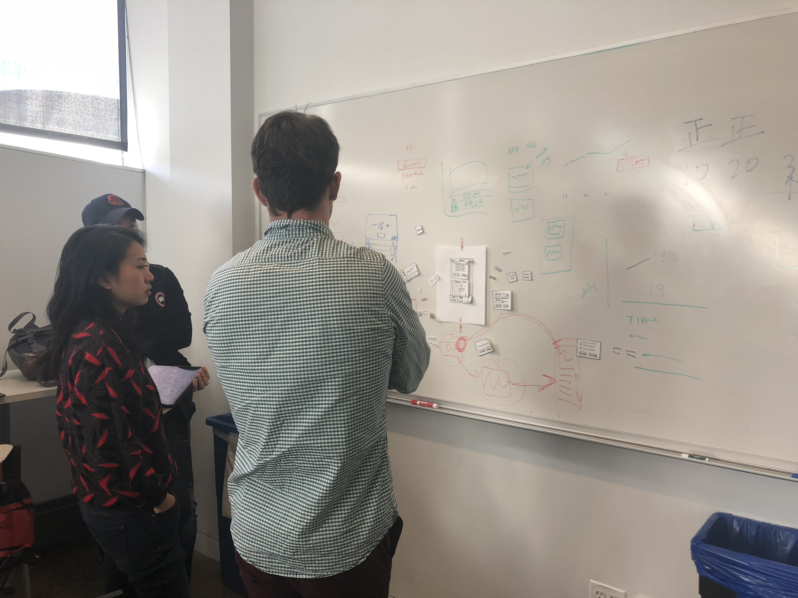

# Milestone 3: Design

## Brainstorming

Each of teammembers did 2 minutes brainstorm ideation for each functionalities we made in previous milestone (2 minutes and 4 sketches per functionalities). And then we grouped all sketches together and discussed as a group to vote great design ideas (circled in color). 

**functionality 1:**
The ability to input and track specific exercises / to do lists / what I did last time so i can decide what to do this time etc. 

**functionality 2:**
The ability to track a before and after so that it will be able to calculate the difference to show the user their progress.

**functionality 3:**
 The ability to control the type of information and amount specific to my needs on the landing. 

## Paper Prototypes & User Testing
We created paper prototypes based on our brainstorm design ideas and scenarios. And we gave over 12 user testings and revised our design twice based on test feedbacks.

## User testing

## Site Map

## Workflow

## Wireframes (Phone & Web)
### Phone version

### Web version

## Rationale

## Revisions to Scenarios
We revised scenarios from Milestone 2 to ensure they are specific enough to be tested and measured. 

**Gym tracking:**
Jason, a professional in his late thirties wants to lose weight and be more fit. He starts going to the gym more frequently and wants to increase the productivity of his workouts. He wants to know if his workouts improve over time. 

**Sleep Tracking:**
Chelsea, a working grad student in her mid twenties is often tired due to lack of sleep. She wants to better understand how her sleep habits affect her moods, energy levels and overall mental well-being. 

**Grocery to do list:**
Heather, 28 year old woman working multiple jobs, wants to keep track of all the items she needs to buy from the grocery store. It is difficult for her to remember while juggling two jobs. She needs to be reminded of all the things she needs to buy while she is at the grocery store. 

[(PDF version here.)](revisedContent/scenarios-revised.pdf)